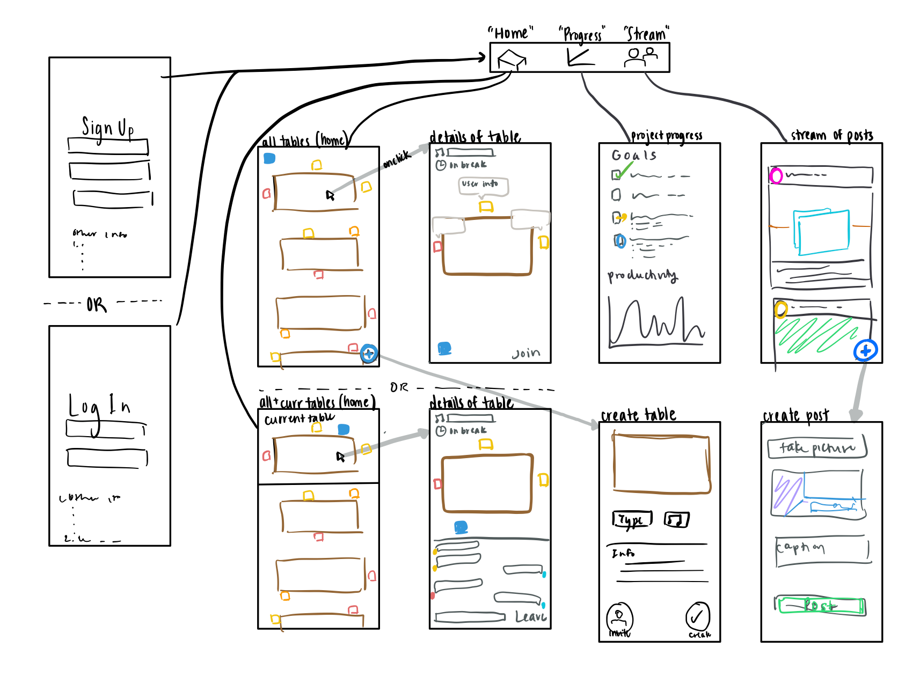

# Virtual Library

## Table of Contents
1. [Overview](#Overview)
1. [Product Spec](#Product-Spec)
1. [Wireframes](#Wireframes)
2. [Schema](#Schema)

## Overview
### Description
A group study app where students can check into app, log their day's goals/topics they're studying, and input their preferences for their study environment. Based on this data, they will get recommendations for "tables" they can join; when they join a table, they can text others at the table, video chat to socialize, listen to music, etc.

### App Evaluation

- **Category:** Productivity, Social
- **Mobile:** Uses camera, audio, real-time.
- **Story:** Allows users to engage in a productive, but still social, work environment even when they are not able to physically enter such an evironment.
- **Market:** Anyone who works at home can enjoy this app.
- **Habit:** Users can have this app open consistently during the work day.
- **Scope:** Having the functionality of getting recommendations and joining tables with some communication is interesting to use and build. Added social features make the app more well-rounded and engaging.

## Product Spec

### 1. User Stories (Required and Optional)

**Required Must-have Stories**

* [x] User can create a new account
* [x] User can login
* [x] User can input their current goals and update the status of their goals
* [x] User can see all tables and join a table
* [x] User can chat with others at their table
* [x] User can post a new photo resource to their feed
* [x] User can view other users' resource posts
* [x] User can view individual profiles from details view of table and see that user's goals/progress
* [x] User can get recommendations for tables they can join

**Optional Nice-to-have Stories**

* [x] User can invite friends
* [x] User can follow other users
* [x] User can search for other users
* [x] User can post a new file resource or link to their feed
* [x] User can choose how to sort the tables
* [x] User can video chat with others at their table
* [x] User can listen to the music at their table

### 2. Screen Archetypes

* Registration Screen
   * User can create a new account
   * User answers some question regarding study habits
* Login Screen
   * User can login
   * User selects their preferences for the day
   * User plans out their goals
* Tables Screen
   * User can see all tables, clicking on the table opens a fragment describing its details
   * User can see the table they're currently at if applicable, clicking on this opens up the current state of the table (chatting, status, etc.)
   * User can see recommendations for the table they should join
   * User can join tables
   * Users can sort tables
   * Users can see invites
* Table Creation
   * User can create their own table for people to join
* Progress
   * User can keep track of how many of their goals they've accomplished
* Stream
   * User can view a feed of photos
* Content Creation
   * User can post a new resource to their feed

### 3. Navigation

**Tab Navigation** (Tab to Screen)

* Home
* Search
* Progress
* Stream

**Flow Navigation** (Screen to Screen)

* Login ->
   * Home
* Registration ->
   * Home
* Home Tab (all Tables, Current Table) ->
   * Details of each Table (on click)
      * User Profiles (on click)
* Search Tab ->
   * User Profiles (on click)
* Create a Table ->
   * Details of the created Table
      * User Profiles (on click)
* Create a post ->
   * Stream
* Project progress ->
   * None

## Wireframes

## Schema

### Models
* Tables
    * Creator
    * Users
    * Status
    * Size
    * Topic
    * Type
    * Visitors allowed
    * Description
    * Locked
    * Chat
    * Invites
* Goals
    * User
    * Status
    * Goal
* Posts
    * User
    * Caption
    * Subject
    * File + File Information
    * Link
    * Image
* Users (to add)
    * Name
    * Profile Picture
    * Goals
    * Bio
    * Current Table
    * Friends
* Invite
    * Sender
    * Reciever
    * Table
    * Type
* Message
    * Text
    * Sender

### Networking
* (Read) Query all tables for user to join
* (Create) New tables
* (Read) Get user's checklist
* (Create) Update user's checklist
* (Read) Get all posts
* (Create) Make a post
* (Read) Get messages for table
* (Create) New messages
* (Read) Get all invites to a user
* (Create) Send an invite
